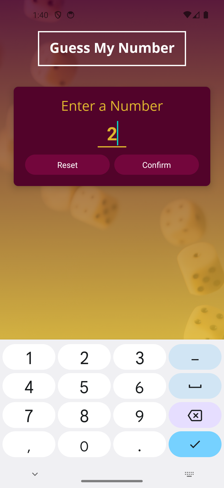
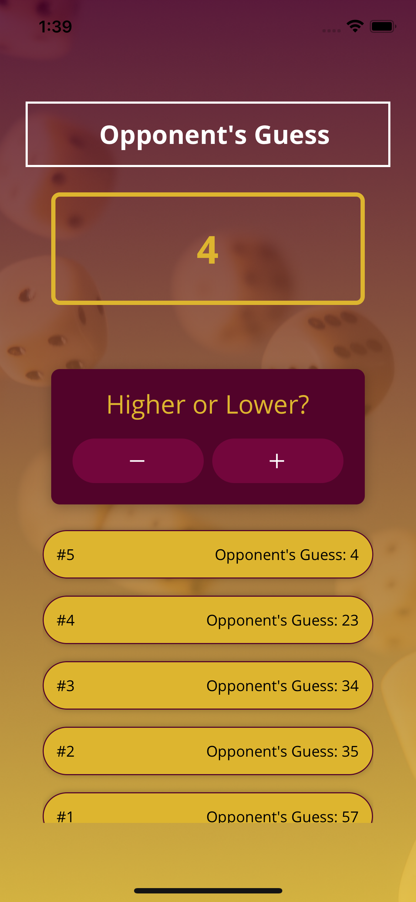
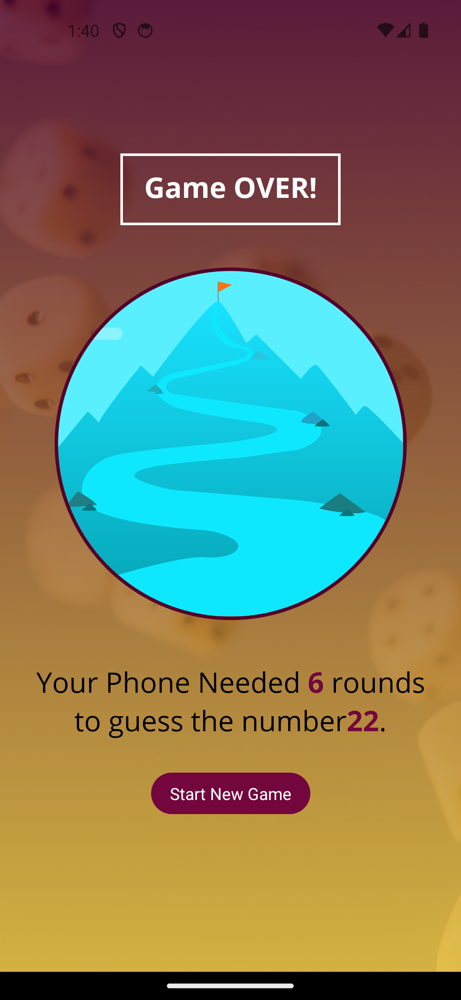

# Goals Mobile Practice Application

  


# About

Guess My Number  is a mobile app is an Application created in React Native Udemy Course. The player can enter a number for the computer to guess. The game logs how many rounds and the current guess it the computer player is making. Player can then increment and decrement to get the opponent to adjust it's guess. When the correct guess is made a game over screen is displayed, and the rounds and inputted number are displayed. A new game can then be started. 

# Install/Setup

To Install and setup the Guess My Number application fork the 'project2' branch or clone the repo. Open in your TextEditor...

```bash

$ npm install

$ npm build

$ npm run start

```

* Note :  you must have an android emulator installed, opened and running, if on mac it will automatically open your simulator application and build it for you*


# License 

MIT License 2023

